# ChemPlasKin CRN — Per-Reactor Integration Step

This block runs **once per reactor** after `runTime += dt` in the main loop.
It is enclosed in a `BoltzmannSolverGuard` which saves and restores the
global `BoltzmannRate::bsolver` state for each reactor.

`T_old[idx]` was captured **before** mass-flow transfer — so `dT` and `dTdt`
reflect the combined thermal change from both mass mixing and chemistry.

```mermaid
flowchart TD
    START(["Begin reactor integration loop\n(idx = 0 .. nReactors-1)"]) --> BGUARD["BoltzmannSolverGuard guard(state.boltzmannState)\n[saves global bsolver state; restores on scope exit]"]

    BGUARD --> CHKDENS{"updateBoltzmannMixture()\nreturns true?\n(Boltzmann species mix changed)"}
    CHKDENS -->|"Yes"| SETDENS["bsolver.set_density(*boltzmannSpecies)\nupdateBoltz = true"]
    CHKDENS -->|"No"| CHKEN
    SETDENS --> CHKEN

    CHKEN{"|EN_temp − bsolver.EN| > EN_TOLERANCE?"}
    CHKEN -->|"Yes"| SETEN["bsolver.set_EN(EN_temp)\nupdateBoltz = true"]
    CHKEN -->|"No"| CHKT
    SETEN --> CHKT

    CHKT{"|T_gas − bsolver.kT| > TGAS_TOLERANCE?"}
    CHKT -->|"Yes"| SETKT["bsolver.set_kT(T_gas)\nupdateBoltz = true"]
    CHKT -->|"No"| ANYUPD
    SETKT --> ANYUPD

    ANYUPD{"updateBoltz == true?"}
    ANYUPD -->|"Yes"| RESOLV["bsolver.init()\nif EN_temp < 1:\n  F0 = bsolver.maxwell(T_gas × kB/eV)\nupdateBoltzmannSolver(200, 1e-5, 1e20/EN_temp^2)\nintegrator->reinitialize(runTimeOld, odes)"]
    ANYUPD -->|"No"| IPULSE0
    RESOLV --> IPULSE0

    IPULSE0{"iPulse == 0?"}
    IPULSE0 -->|"Yes (first pulse)"| REINIT["integrator->reinitialize(runTimeOld, odes)"]
    IPULSE0 -->|"No"| INTEGRATE
    REINIT --> INTEGRATE

    INTEGRATE["Print: EN, T_gas, T_e, n_e\nintegrator->integrate(runTime)\nodes->updateState(integrator->solution())"]

    INTEGRATE --> DT["dT = |T_gas − T_old[idx]|\n[T_old was captured before mass transfer]"]

    DT --> WRITE["Write to CSV:\nrunTime, T_gas, p, N_gas\nfor each species: number density [#/cm³]"]

    WRITE --> POWER["power_temp = bsolver.elec_power()\n × Avogadro × molarDensity × eCharge × n_e\n[W/cm³]\ndisEnergy = odes->depositedPlasmaEnergy() [mJ/cm³]"]

    POWER --> WPOWER["Write to CSV: power_temp, disEnergy"]

    WPOWER --> DISCOFF["dischargeOn = (disEnergy < Ep)\n[cut off discharge once energy threshold reached]"]

    DISCOFF --> UPDTDT["dTdt = dT / dt\nif dTdt > dTdt_max AND iStepAfPulse > 1:\n  dTdt_max = dTdt\n  time_max_dTdt = runTime  [ignition delay candidate]"]

    UPDTDT --> NEXTPULSE{"runTime + SMALL >= (iPulse + 1) × pulsePeriod?\n(entering next pulse period)"}

    NEXTPULSE -->|"No"| EXITGUARD
    NEXTPULSE -->|"Yes"| IPULSEUP["iPulse++"]

    IPULSEUP --> LASTPULSE{"iPulse == nPulses?"}
    LASTPULSE -->|"Yes — all NRP done"| ALLPULSESDONE["integrator->reinitialize(runTime, odes)\nplasmaOn = false\nPrint: NRP Discharges Finished"]
    ALLPULSESDONE --> EXITGUARD

    LASTPULSE -->|"No"| PLASMAON{"plasmaOn?"}
    PLASMAON -->|"No"| EXITGUARD
    PLASMAON -->|"Yes"| NEWPULSE["Print: Start Pulse Loop No. iPulse+1\nif heatLoss:\n  odes->setConstPD(P, rho)\n  constPressure = false  (switch to CV)\ndisEnergy = 0\ndischargeOn = true\nodes->resetDepositedPlasmaEnergy()\niStepInPulse = 0, iStepAfPulse = 0\nnE_1 = n_e_current"]
    NEWPULSE --> EXITGUARD

    EXITGUARD["BoltzmannSolverGuard destructs\n[restores bsolver state]\nstate.boltzmannState.density = *boltzmannSpecies"]

    EXITGUARD --> NEXTREAC{"More reactors\nto integrate?"}
    NEXTREAC -->|"Yes"| START
    NEXTREAC -->|"No"| DONE(["Return to main loop\ndTdtcheck = max_element(dTdt_vec)"])
```



## Output CSV columns

```
Time(s), T_gas(K), p(Pa), N_gas(#/cm³), [species_1], ..., [species_N], Power_input(W/cm³), Energy_deposited(mJ/cm³)
```

## Boltzmann update logic

The EEDF is re-solved only when one of three triggers fires (change in mixture,
E/N, or T_gas beyond tolerance). This avoids expensive re-solves at every step.
When `EN_temp < 1 Td`, a Maxwell EEDF is used as the initial guess for convergence.
