# ChemPlasKin CRN — Main Program Flowchart

> **Sub-flowcharts** for complex blocks:
> - Mass flow transfer → `flowchart_massflow.md`
> - Time step selection → `flowchart_timestep.md`
> - Per-reactor ODE integration → `flowchart_integration.md`
> - Python mass-flow bridge → `flowchart_pybridge.md`

```mermaid
flowchart TD
    START([Program Start]) --> H1["printHeader()"]
    H1 --> CLI["Parse CLI args\n-case path → override dict file paths\n-log NONE/WARNING/INFO/DEBUG → set CppBOLOS log level\nDefault paths: ../controlDict, ../chemPlasProperties, ../crnDict"]

    CLI --> CHK{"All three dict files\nexist on disk?"}
    CHK -->|"No"| ERR1(["EXIT 1 — file not found"])
    CHK -->|"Yes"| RC["Read controlDict\nstartTime, endTime, nPulses, dt1, dt_max\npulseExten, NstepInPulse, NstepAfPulse\ndT_max, dTdt_min, odes.reltol, odes.abstol\n[optional] endTimeForce"]

    RC --> RCP["Read chemPlasProperties\nT, P, EN, EN_DC, stayDC, N_e_ini, Ep\nf_NRP, pulseWidth, TGAS/EN_TOLERANCE\nBoltzmannSpecies, Mixture, fuelName, oxName\nplasmaHeatModel, CP_or_CV, nonThermal\nheatLoss, C0, inertSpecies, electronDens\nmechFile, csDataFile, gridType, gridSize"]

    RCP --> PCRN["readReactors(crnDict)\nreadMassFlowControllers(crnDict)"]

    PCRN --> FILL["Fill missing fields in each reactorZone\nfrom global defaults:\nmechFile, T, P, N_e_ini, outputFile\ncomposition → BoltzmannSpecies (local or global)"]

    FILL --> CVOL{"All non-reservoir reactors\nhave volume > 0?"}
    CVOL -->|"No"| ERR2(["EXIT 1 — volume error"])
    CVOL -->|"Yes"| BOLTZ["Init Boltzmann solver grid\nload cross-section collisions from csDataFile\nBoltzmannRate::bsolver.set_grid + load_collisions"]

    BOLTZ --> CRES["For each reactorZone:\ntype != reservoir → createReactorState()\ntype == reservoir  → createReservoirState()\n[sets gas state, ODE system, integrator, output file]"]

    CRES --> PY["MassFlowSolverSession pySession\nSee flowchart_pybridge"]

    PY --> LINIT["dTdtcheck = dTdt_min × 10\nrunTime = startTime\nt_end = max(nPulses × pulsePeriod, endTime)\nt_end = min(t_end, endTimeForce)"]

    LINIT --> WCOND{"runTime < t_end\nAND\ndTdtcheck > dTdt_min?"}

    WCOND -->|"No"| POST["Print per-reactor ignition delay times\nPrint termination reason\nPrint elapsed CPU time"]
    POST --> STOP([Program End])

    WCOND -->|"Yes"| TOLD["For each reactor idx:\nT_old[idx] = gas->temperature()\n[captured BEFORE mass transfer]"]

    TOLD --> YMAPS["Build yFuel, yOx maps\nfor each reactor and reservoir:\nyFuel[name] = elementalMassFraction(fuelElement)\nyOx[name]   = elementalMassFraction(oxElement)"]

    YMAPS --> PYCALL["pySession.call(yOx, yFuel)\n→ massFlowRates dict\nSee flowchart_pybridge"]

    PYCALL --> UMFC["Update each massFlowController.value\nfrom massFlowRates[name]\n[throws if controller name not found in Python output]"]

    UMFC --> MF["Two-pass mass flow transfer\nSee flowchart_massflow"]

    MF --> DT["For each reactor:\ndt_element = dt_prev\nfindTimeStep(state, config, runTime, ...)\ndt = min(dt, dt_element)\nSee flowchart_timestep"]

    DT --> ADV["runTime += dt"]

    ADV --> INT["For each reactor:\nBoltzmann update check\nODE integrate(runTime)\nWrite output to CSV\nPulse counter management\nSee flowchart_integration"]

    INT --> DTCHK["dTdtcheck = max_element(dTdt_vec)\n[loop continues while ANY reactor is still thermally active]"]

    DTCHK --> WCOND
```

## Notes on createReactorState

For each non-reservoir zone, `createReactorState` performs:

1. Initialise Boltzmann solver with reactor composition and solve EEDF (convergence check)
2. `BoltzmannSnapshot::capture()` → save Boltzmann state
3. `newSolution(mechFile)` → create Cantera `ThermoPhase` / `Kinetics`
4. Create `ChemPlasReactor` ODE system
5. Set initial gas state: `setState_TPX(T, P, composition)`, record `setConstPD`
6. Read `nonThermal`, `heatLoss`, `CP_or_CV`, `C0`, `inertSpecies` from chemPlasProperties
7. Create CVODE integrator, set tolerances from `odes` block
8. Open per-reactor CSV output file, write header row + initial values
