# ChemPlasKin CRN — Two-Pass Mass Flow Transfer

Called once per main time-loop iteration, after `massFlowControllers.value` has been
updated by the Python solver.

**Why two passes?**
If multiple controllers feed the same destination reactor, a single-pass sequential update
would use an already-modified end-state for subsequent controllers.
The two-pass approach reads all source states first (Pass 1), then applies all accumulated
contributions simultaneously (Pass 2), giving the physically correct mixed state regardless
of controller processing order.

```mermaid
flowchart TD
    START([Begin mass flow step]) --> STRUCT["Define per-destination accumulator\nEndAccum: sumYmass[k], sumMass, sumBoltzXn[sp],\nsumN, sumCpMassT, sumCpMass\nInitialize endAccum map (empty)"]

    STRUCT --> P1H["PASS 1 — read source states, update source density,\naccumulate contributions for each destination"]

    P1H --> P1L["For each MassFlowController mfc\n(name, start, end, value [kg/s])"]

    P1L --> MXFR["mass_transferred = mfc.value × dt  [kg]"]

    MXFR --> CHKNEG{"mass_transferred < 0?"}
    CHKNEG -->|"Yes"| WARN["cerr Warning: negative mass transfer\n[check massflowsolver sign convention]"]
    WARN --> GETCONF
    CHKNEG -->|"No"| GETCONF["Get configStart = reactorZones[mfc.start]\nGet configEnd   = reactorZones[mfc.end]"]

    GETCONF --> SRCT{"configStart.type\n== 'reactor'?"}

    %% --- SOURCE IS A REACTOR ---
    SRCT -->|"Yes (reactor source)"| RST["stateStart = reactors[configStart.indexState]\nnStart     = molarDensity × volume  [kmol]\nmass_start = nStart × molarMass     [kg]\nT_src  = gas->temperature()\ncp_src = gas->cp_mass()"]

    RST --> PRESCHECK{"configEnd.type\n== 'reservoir'?"}

    PRESCHECK -->|"Yes — pressure-driven outflow"| PRESADD["mass_transferred += kOutPressure × (P_src − P_reservoir) × dt\n[P_reservoir = configEnd.pressure.value()]"]
    PRESADD --> CLAMP
    PRESCHECK -->|"No"| CLAMP

    CLAMP["n_transferred    = mass_transferred / molarMass\nn_transferred    = min(n_transferred, nStart)   [clamp]\nmass_transferred = n_transferred × molarMass    [kg]"]

    CLAMP --> ENDT1{"configEnd.type\n== 'reactor'?"}

    ENDT1 -->|"Yes — accumulate"| ACC1["endAccum[mfc.end]:\nFor each dest species k:\n  k_src = stateStart->speciesIndex(speciesName(k))\n  sumYmass[k] += Y_src[k_src] × mass_transferred\nFor each Boltzmann sp:\n  sumBoltzXn[sp] += X_boltz_src[sp] × n_transferred\nsumMass    += mass_transferred\nsumN       += n_transferred\nsumCpMassT += cp_src × mass_transferred × T_src\nsumCpMass  += cp_src × mass_transferred"]
    ACC1 --> UPDSRC

    ENDT1 -->|"No (reservoir end)\nskip accumulation"| UPDSRC

    UPDSRC["Always update source density:\nnew_rho_start = (mass_start − mass_transferred) / volume\ngas->setState_TD(T_src, new_rho_start)\nodes->setConstPD(P, new_rho_start)\nintegrator->reinitialize(runTime, odes)"]

    %% --- SOURCE IS A RESERVOIR ---
    SRCT -->|"No (reservoir source)"| ENDTR{"configEnd.type\n== 'reactor'?"}

    ENDTR -->|"No — skip"| P1NEXT

    ENDTR -->|"Yes"| RSVR["stateStart = reservoirs[configStart.indexState]\nT_src  = gas->temperature()\ncp_src = gas->cp_mass()\nn_transferred = mass_transferred / molarMass\n[no clamping — infinite supply]\n[no source density update]"]

    RSVR --> ACC2["endAccum[mfc.end]:\nSame accumulation as reactor source case"]

    UPDSRC --> P1NEXT
    ACC2   --> P1NEXT

    P1NEXT{"More\ncontrollers?"}
    P1NEXT -->|"Yes"| P1L
    P1NEXT -->|"No"| P2H

    P2H["PASS 2 — apply accumulated contributions to each destination reactor"]

    P2H --> P2L["For each (endName, accum) in endAccum"]

    P2L --> SKIP{"accum.sumMass <= 0?"}
    SKIP -->|"Yes — skip"| P2NEXT
    SKIP -->|"No"| REND["stateEnd = reactors[configEnd.indexState]\nnEnd     = molarDensity × volume  [kmol]\nmass_end = nEnd × molarMass       [kg]\nT_end = gas->temperature()\ncp_end = gas->cp_mass()"]

    REND --> MBOLTZ["Mix Boltzmann species (mole-weighted):\nFor each sp in boltzmannSpecies:\n  sumX = sumBoltzXn[sp]  (0 if absent)\n  X_end[sp] = (X_end × nEnd + sumX) / (nEnd + sumN)"]

    MBOLTZ --> MTEMP["Mix temperature via enthalpy balance:\nT_new = (cp_end × mass_end × T_end + sumCpMassT)\n      / (cp_end × mass_end + sumCpMass)"]

    MTEMP --> MYFRAC["Mix all K species by mass fraction:\nmass_total = mass_end + sumMass\nY_new[k] = (Y_end[k] × mass_end + sumYmass[k]) / mass_total"]

    MYFRAC --> APPL["new_rho_end = mass_total / volume\ngas->setMassFractions_NoNorm(Y_new)\ngas->setState_TD(T_new, new_rho_end)\nodes->setConstPD(P_new, new_rho_end)\nboltzmannState.density = boltzmannSpecies\nintegrator->reinitialize(runTime, odes)"]

    APPL --> P2NEXT

    P2NEXT{"More\ndestinations?"}
    P2NEXT -->|"Yes"| P2L
    P2NEXT -->|"No"| DONE([End mass flow step])
```

## Key physical formulas

| Quantity | Formula | Unit |
|---|---|---|
| n_transferred | `min(mass/M_src, n_start)` | kmol |
| mass_transferred (clamped) | `n_transferred × M_src` | kg |
| T_mix (enthalpy balance) | `(cp_end·m_end·T_end + Σcp_i·m_i·T_i) / (cp_end·m_end + Σcp_i·m_i)` | K |
| Y_mix[k] | `(Y_end[k]·m_end + ΣY_i[k]·m_i) / (m_end + Σm_i)` | — |
| X_boltz_mix[sp] | `(X_end·n_end + ΣX_i·n_i) / (n_end + Σn_i)` | — |
| ρ_end_new | `(m_end + Σm_i) / V_end` | kg/m³ |

> **Species index safety**: species are looked up by name across different `ThermoPhase` objects
> (`speciesIndex(speciesName(k))`), not by raw index. Missing species map to Y=0.
