# ChemPlasKin CRN — MassFlowSolverSession Python Bridge

`MassFlowSolverSession` is a RAII class that manages a single embedded Python
interpreter for the lifetime of the simulation.
`Py_Initialize` / module import happen once in the constructor;
`Py_Finalize` happens once in the destructor.
`call()` is invoked inside the main time loop at every timestep.

```mermaid
flowchart TD

    subgraph CTOR ["Constructor — called once before the main loop"]
        C1["Py_Initialize()"] --> C2["PySys_GetObject('path')\nPyList_Insert(sysPath, 0, MASSFLOW_SCRIPT_DIR)\n[MASSFLOW_SCRIPT_DIR is embedded at compile time\nvia CMake target_compile_definitions]"]
        C2 --> C3["PyImport_ImportModule('massflowsolver')"]
        C3 --> C4{"Import OK?"}
        C4 -->|"No"| C5["PyErr_Print()\nPy_Finalize()\nthrow runtime_error"]
        C4 -->|"Yes"| C6["PyObject_GetAttrString(module_, 'mainSolver')"]
        C6 --> C7{"func_ callable?"}
        C7 -->|"No"| C8["PyErr_Print()\nPy_XDECREF(func_)\nPy_DECREF(module_)\nPy_Finalize()\nthrow runtime_error"]
        C7 -->|"Yes"| C9(["Ready for call()"])
    end

    subgraph CALL ["call(ox_Y, fuel_Y) — called every timestep"]
        K1(["call(ox_Y: map, fuel_Y: map)"]) --> K2["buildPyDict(ox_Y)  → PyObject* pyOxY\nbuildPyDict(fuel_Y) → PyObject* pyFuelY\n[each map entry becomes a PyFloat in a PyDict]"]
        K2 --> K3["args = PyTuple_Pack(2, pyOxY, pyFuelY)"]
        K3 --> K4["result = PyObject_CallObject(func_, args)\nPy_DECREF(args, pyOxY, pyFuelY)"]
        K4 --> K5{"result non-null\nand PyDict?"}
        K5 -->|"No"| K6["PyErr_Print()\nthrow runtime_error"]
        K5 -->|"Yes"| K7["PyDict_Next(result) iteration:\n→ massFlows[key] = PyFloat_AsDouble(value)"]
        K7 --> K8["Py_DECREF(result)\nreturn massFlows as map<string,double>"]
    end

    subgraph DTOR ["Destructor — called once at end of main()"]
        D1["Py_XDECREF(func_)"] --> D2["Py_XDECREF(module_)"]
        D2 --> D3["Py_Finalize()"]
    end
```



## massflowsolver.py interface

```
mainSolver(ox_Y: dict, fuel_Y: dict) → dict
```

| Input | Type | Content |
|---|---|---|
| `ox_Y` | `dict[str→float]` | Elemental O mass fraction per zone (reactors + reservoirs) |
| `fuel_Y` | `dict[str→float]` | Elemental H (or fuel) mass fraction per zone |

| Output key | Description |
|---|---|
| `airI .. airIII` | Pre-calculated air inlet flow rates [kg/s] |
| `fuelI, fuelII` | Pre-calculated fuel inlet flow rates [kg/s] |
| `mOut` | Total outlet flow rate [kg/s] |
| `mA .. mO` | Internal reactor-to-reactor flow rates solved by the linear system [kg/s] |

> **Requirement**: every key returned by `mainSolver` must match exactly the names
> of the `massFlowControllers` entries in `crnDict`. A mismatch causes a `runtime_error`.

## CMake compile definition

```cmake
target_compile_definitions(ChemPlasKin PRIVATE
    MASSFLOW_SCRIPT_DIR="${CMAKE_CURRENT_SOURCE_DIR}")
```

This embeds the source directory as a C++ string literal at compile time so the
binary can locate `massflowsolver.py` regardless of the working directory at runtime.
