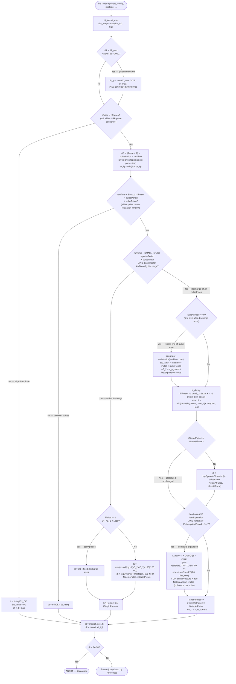

# ChemPlasKin CRN — findTimeStep Flowchart

`findTimeStep` is called **once per reactor** per main time-loop iteration.
It modifies `dt` (passed by reference) and `EN_temp`.
The outer loop then takes `dt = min(dt, dt_element)` across all reactors.



## Pulse phase timeline

```
 |<-- pulseWidth -->|<--- pulseExten (total) ------>|<--- inter-pulse gap --->|
 [  DISCHARGE ON   ][  DISCHARGE OFF + relaxation  ][     normal dt_max      ]
  iStepInPulse++     iStepAfPulse++
  EN_temp = EN       EN_temp -> DC
  dt = logDynamic    dt = logDynamic (decay K)
  (growth K)
```

## logDynamicTimestep behaviour

| Parameter | Meaning |
|---|---|
| `K > 0` | Logarithmically growing dt during discharge (electron density rises) |
| `K < 0` | Logarithmically decaying dt during relaxation (electron density falls) |
| `K = -1` | Fixed early-pulse fallback (first two pulses or very low nE) |
| `iStepAfPulse >= NstepAfPulse` | Plateau: dt frozen at last value to prevent dt runaway |
